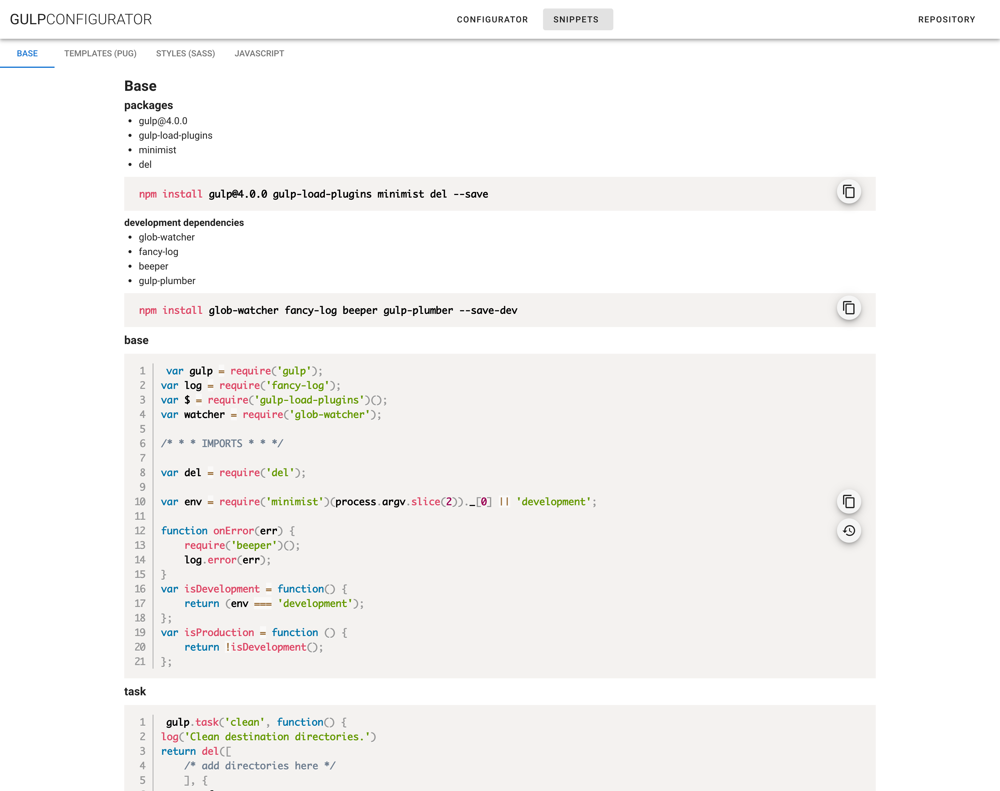
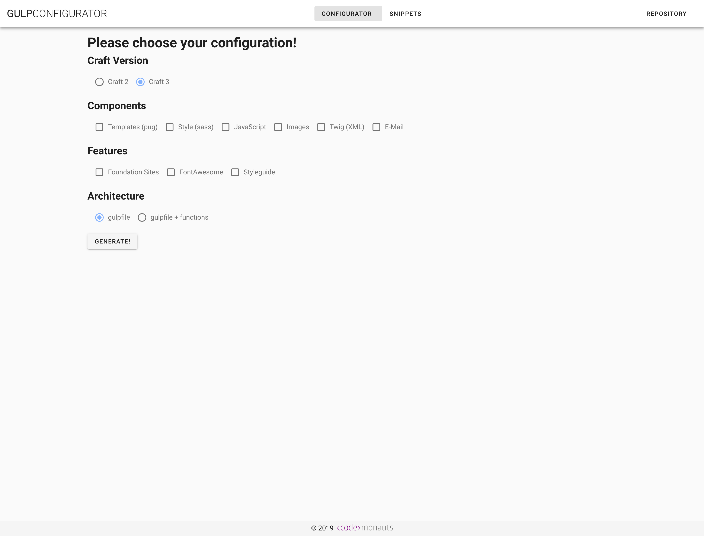

# gulp-configurator

Looking for the same gulp snippets over and over again? Copying the gulpfile from project to project?
This app provides help for both those scenarios:

## Snippets
You'll find various snippets for gulp. Ranging from the base outline to template, style and javascript processing or more sophisticated and custom tasks as newsletter processing or pattern library generation.

## Configurator
The configurator form allows you to preselect all features for the new project and generates the whole gulpfile in one step. Copy and paste the output, run the npm install commands and you're good to go.

## Development
### Libraries
- UI Components: [Vuetify](https://vuetifyjs.com)
- Code Highlighting: [Prism.js](https://prismjs.com/index.html) (Config via [babel-plugin-prismjs](https://github.com/mAAdhaTTah/babel-plugin-prismjs))

### Project setup
- setup: `yarn install`
- Compiles and hot-reloads for development: `yarn run serve`
- Compiles and minifies for production: `yarn run build`
- Run your tests: `yarn run test`
- Lints and fixes files: `yarn run lint`
- Customize configuration: See [Configuration Reference](https://cli.vuejs.org/config/).
